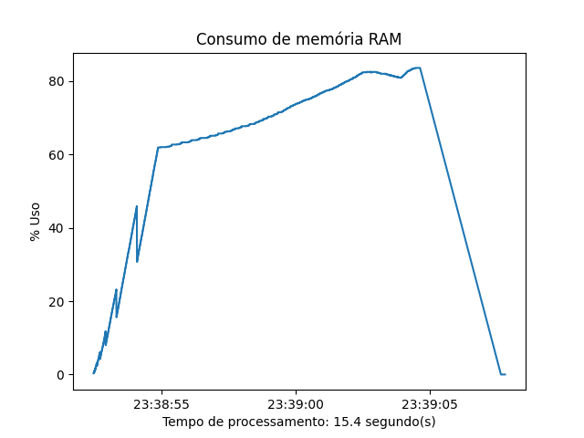

# <b>Monitoramento consumo de memória RAM</b>

Este script apresenta de forma simples um <b>método para monitoramento do percentual de memória RAM consumido</b> de uma máquina por uma função ou processo.

Como exemplo, no início do script foi desenvolvida uma função denominada "geracao_dataframe" para demonstração do funcionamento do método. A imagem abaixo é o resultado da execução do script:

Caso a necessidade seja de acompanhamento do percentual de CPU consumido, basta alterar neste script o método <i>memory_percent</i> para <i>cpu_percent</i>.